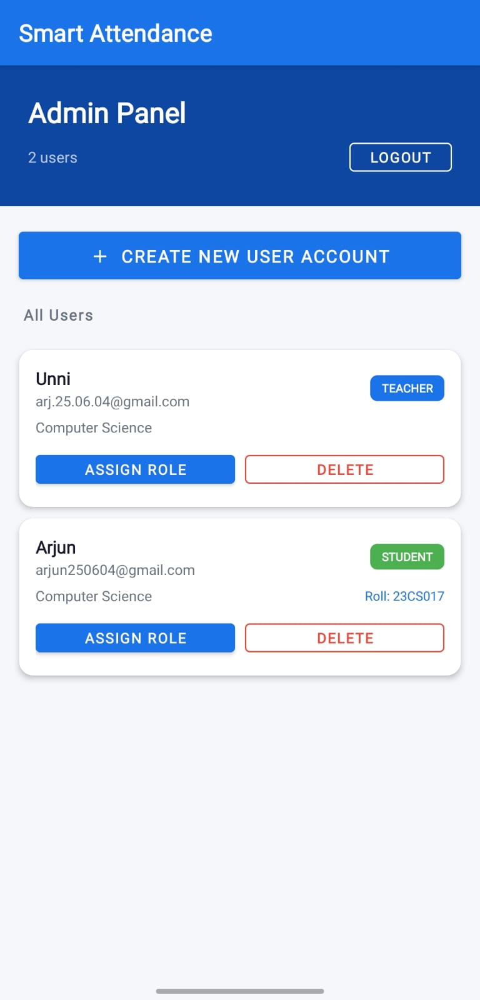
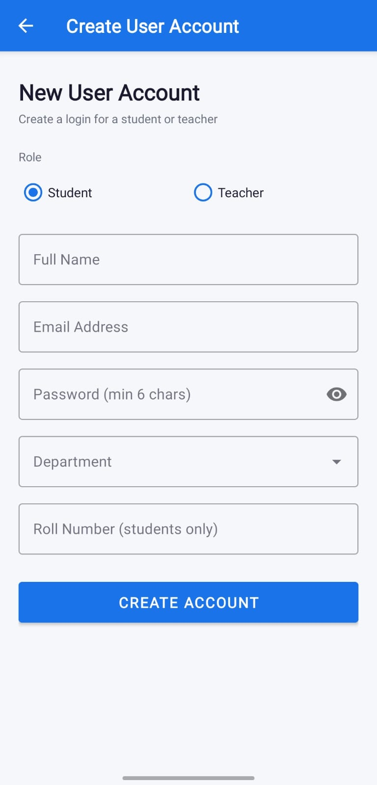
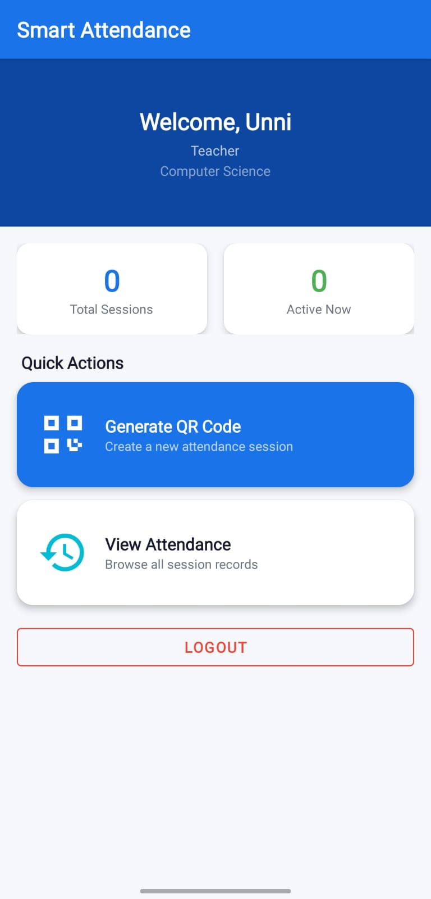
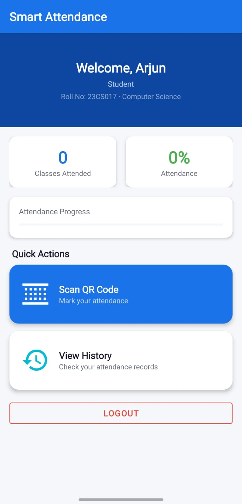

# Smart Attendance App – QR Code Based

A **minor project** Android application built with Kotlin + Firebase that automates classroom attendance using dynamic, time-limited QR codes.

## 📦 Download App
**[Download the latest APK here](https://github.com/arjun250604/SmartAttendance_With_QR_ajn/releases/download/v1.0.0/app-debug.apk)**

---

## 📱 Features

| Feature | Description |
|---|---|
| 👑 Admin Panel | Admin can create users, assign roles, and delete accounts |
| 🔐 Firebase Auth | Secure student/teacher login |
| 📷 QR Generation | Teacher creates a session QR with embedded payload |
| ⏱ Expiry Validation | QR codes auto-expire (2–30 min configurable) |
| 📡 Real-time Firestore | Attendance stored instantly in Firestore |
| 🚫 Proxy Prevention | Duplicate scan detection + server-side session verification |
| 📊 Attendance History | Both teacher and student views |
| 📈 Percentage Tracker | Students see live attendance % |

---

## 📸 Screenshots

| Admin Dashboard | Create User | Teacher Dashboard | Student Dashboard |
|:---:|:---:|:---:|:---:|
|  |  |  |  |

---

## 🏗 Architecture

```
app/
├── data/
│   ├── model/          ← Data classes (User, AttendanceSession, AttendanceRecord, QRPayload)
│   └── repository/     ← AuthRepository, AttendanceRepository
├── ui/
│   ├── admin/          ← AdminDashboardActivity, CreateUserActivity
│   ├── auth/           ← SplashActivity, LoginActivity, RegisterActivity
│   ├── teacher/        ← TeacherDashboardActivity, GenerateQRActivity
│   ├── student/        ← StudentDashboardActivity, ScanQRActivity
│   └── attendance/     ← AttendanceHistoryActivity
└── util/               ← QRUtils, Resource, Extensions
```

---

## 🚀 Setup Instructions

### 1. Firebase Project Setup
1. Go to [Firebase Console](https://console.firebase.google.com)
2. Create a new project: **SmartAttendance**
3. Add an **Android app** with package name: `com.smartattendance.qrapp`
4. Download `google-services.json` → place in `app/` folder
5. Enable **Firebase Authentication** → Email/Password
6. Enable **Cloud Firestore** → Start in test mode → Apply security rules from `firestore.rules`

### 2. Firestore Collections (auto-created on first use)
| Collection | Purpose |
|---|---|
| `users` | User profiles (uid, name, email, role, rollNumber, department) |
| `sessions` | Attendance sessions with QR payload and expiry |
| `attendance_records` | Individual student attendance entries |

### 3. Build in Android Studio
1. Open the project in **Android Studio Hedgehog** or newer
2. Place `google-services.json` in `app/` directory
3. Sync Gradle → **Build → Make Project**
4. Run on device or emulator with **API 24+**

---

## 🔒 Security
- QR codes contain JSON payload with `expiresAt` timestamp
- Server-side validation checks session status in Firestore
- Firestore rules prevent:
  - Students from creating sessions
  - Duplicate attendance records (immutable once written)
  - Cross-user data access

---

## 📚 Libraries Used
| Library | Purpose |
|---|---|
| Firebase Auth | User authentication |
| Firebase Firestore | Cloud database |
| ZXing Android Embedded | QR code scanning |
| ZXing Core | QR code generation |
| Material Components | Modern UI |
| Kotlin Coroutines | Async operations |

---

## 👨‍💻 Team
Minor Project – Smart Attendance App using QR Code  
Department: Computer Science  

---

## 📄 License
This project is licensed under the MIT License. See the [LICENSE](LICENSE) file for details.
